# Documentation

This document serves the purpose to analyze each feature Rainwater provides and explain to the user how to implement them.

## Directory Structure

To make an idea of how a project using the Rainwater clean architecture concept looks like in terms of folder hierarchy, see the following expanded tree:

```
my_flutter_app/
├─ lib/
│  ├─ app/
│  ├─ authentication/
│  │  ├─ bloc/
│  │  │  ├─ authentication_bloc.dart
│  │  │  ├─ authentication_state.dart
│  │  │  ├─ authentication_event.dart
│  │  ├─ input/
│  │  │  ├─ email.dart
│  │  │  ├─ password.dart
│  │  ├─ view/
│  │  │  ├─ authentication_page.dart
│  │  │  ├─ authentication_view.dart
│  │  ├─ widgets/
│  │  │  ├─ authentication_tab_widget.dart
│  │  ├─ authentication.dart
│  ├─ profile_creation/
│  ├─ main.dart
├─ packages/
│  ├─ my_flutter_authentication/
│  │  ├─ lib/
│  │  │  ├─ src/
│  │  │  │  ├─ models/
│  │  │  │  │  ├─ user_account.dart
│  │  │  │  ├─ exceptions/
│  │  │  │  │  ├─ authentication_exception.dart
│  │  │  │  ├─ repositories/
│  │  │  │  │  ├─ authentication_repository_interface.dart
│  │  │  │  │  ├─ mocked_authentication_repository.dart
│  │  │  │  │  ├─ firebase_authentication_repository.dart
│  │  │  ├─ authentication.dart
│  │  ├─ pubspec.yaml
│  ├─ my_flutter_theme/
├─ pubspec.yaml
```

The _lib/_ folder must contain directories each representing a **piece of functionality** or **feature** and finally the entry-point of your app, _main.dart_:

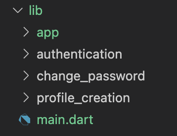

The _packages/_ folder contain directories each representing either a **package** or **module** that exposes **models** and **data repositories** or a theme library. Generally, custom packages made solely for the project. This ensures maximum abstraction and therefore, scalability.

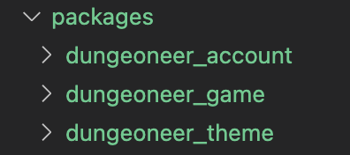

Treating packages as microservices is beneficial to the overall structure therefore it is also allowed to host them somewhere separate, for example on multiple github repositories. The _packages/_ folder only contains local packages.

### Feature Directory

A feature directory or &quot;module&quot; contains everything regarding that specific functionality.
This is where you find your **view** and **logic** , each in it&#39;s own folder:

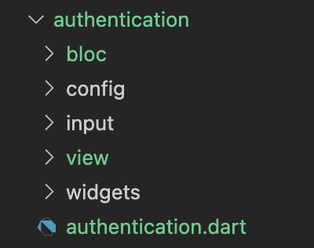

A barrel file (_authentication.dart)_ is also present, exporting all the files:

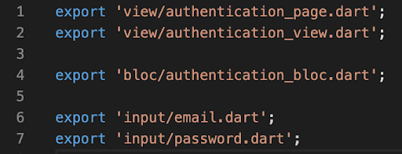

**Each folder and file should be respecting the snake case style** _(profile\_creation/, profile\_creation\_page.dart)._

### View Directory

The view directory relates only to the specific functionality. It must have 2 files:

- View (_authentication\_view.dart_) - containing **UI & Widgets**
- Page (_authentication\_page.dart_) - exposing logic **providers** & routing to the view

Example of a page's code:

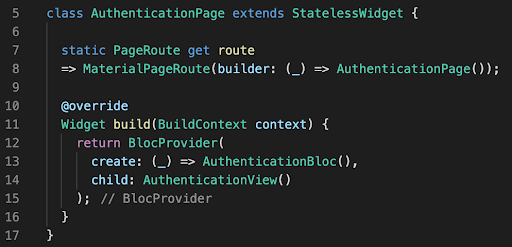
Where **AuthenticationView** is a normal Widget where you build your UI.

Tip: If you have an **authentication** directory, but you want your **sign up** and **log in** to be separate pages and have two distinct views, you are **NOT** going to create a view folder inside authentication. Instead, _authentication_ will contain logic for creating an account and logging in, while _sign\_up_ and _log\_in_ will contain the _view_.

### BLoC Directory

You will write your feature-specific logic in a folder named &quot;cubit&quot; or &quot;bloc&quot;. Normally, a bloc contains 3 files: the bloc itself, the state and the event. A cubit will only have the cubit and the state. Eg. _authentication\_bloc.dart, authentication\_state.dart, authentication\_event.dart_.

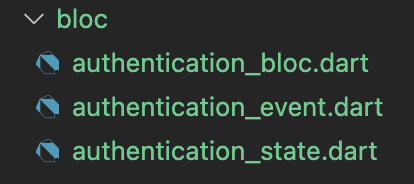

### Input Directory

If your feature is going to contain text fields for user input, a directory named _input_ will also be present. Every field type must have it&#39;s own **formz** file. [You can read about formz here](https://pub.dev/packages/formz).

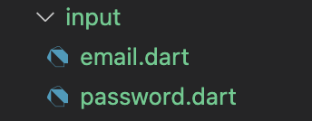

### Widgets Directory

Widgets that are being used inside the view are located inside a _widgets_ folder.

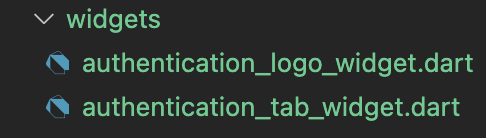

### Config Directory

A feature might need a configuration or static data. This should go into a it&#39;s own _config_ folder.

### Other Directories

These are the most common folders you&#39;ll have inside a feature that should cover most of your needs. If anything, you can create more.

Overall, a feature directory respecting Rainwater would look like this:

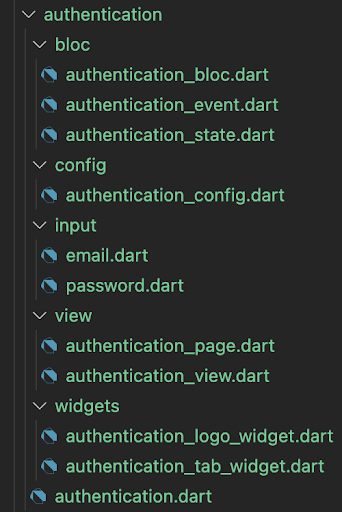

### Packages Directory

As previously mentioned, we consider packages - Flutter or Dart modules that we use in our app. To persist abstraction as much as possible, our data services, repositories and models will be separated into these packages; same with our theme library.

These packages can be situated inside the Flutter app directory or in a separate place, in case you will need to re-use them, maybe in an admin panel for your app.

A packages directory situated inside your flutter app should look similar to the example below:

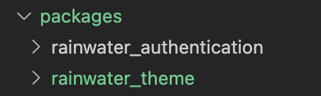

A theme package is a Flutter library that contains all your custom widgets and theme data used in your app.

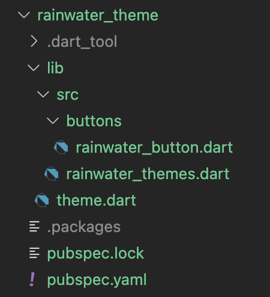

A data package is a standard data provider that exposes models and repositories for your use. A repository can access data either on a local disk or the internet.

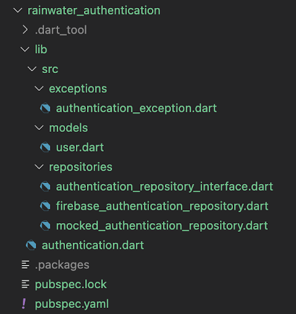

As observed, we have 3 main folders:

- models - models specific for our module
- repositories - data service for our module - abstracted into an interface and implementations
- _exceptions_ - if you want to use custom exceptions (example)

## Examples

You can find examples at the Rainwater Github repo, including the infamous counter, authentication but also a board game manager.