# Documentation

This document analyzes the architecture, structure, and implementation of the architectural design pattern BRUT.

## Table of Contents

1. [Overview](#overview)
2. [General Architecture](#general-architecture)
3. [Directory Structure](#directory-structure)
4. [Examples](#examples)
5. [CLI](#cli)
6. [Why?](#why)
7. [Contribute](#contribute)

## Overview

BRUT is an architectural design pattern that uses BLoC to create an architecture featuring:

- Separation of models, logic and view
- A firm and consistent directory structure that is easy to understand
- Treatment of models and data providers as microservices separate from the main application
- Abstraction of data repositories, allowing modular backend implementation

## General Architecture

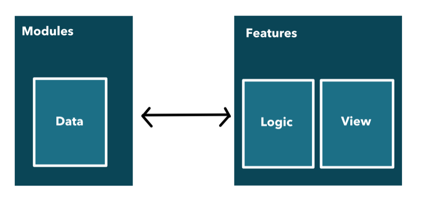

By using the bloc pattern, we separate our application into three layers:
- Presentation View
- Business Logic
- Data
  - Models
  - Repositories

We treat and organise these layers as such:
- A **feature** is a 1-to-1 correspondence of *business logic* and *presentation*
- A **module** is a package that acts as a microservice consisting of *models* and *data repositories* that feed into multiple features

A general relation between data and features can be observed in the following diagram:

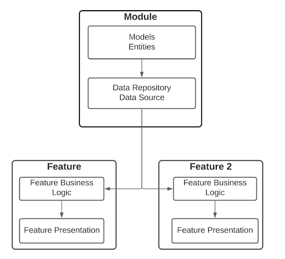

### Data Layer

The data layer is our module layer. A data module contains **models**, **data sources**, and **data repositories** that provide our application with either real or mocked data.

**Reusable**: Treating data layers as microservices helps us with reusability across multiple projects and is generally a good rule for clean architecture. These services are basic Flutter or Dart **packages**, then referenced in our main app's `pubspec.yaml` file.
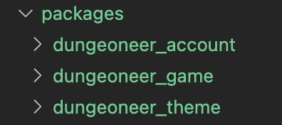

These packages can be stored in a directory - */packages* or */modules* in our main project folder and referenced locally or elsewhere, such as hosted on a git source.

[See directory example for modules.](#module_directory)

**Scalable**: For each data source, there MUST be an abstract repository **interface** implemented by one or more repositories. This allows us to implement multiple repositories (e.g., Firebase, RESTful, Mocked, Local Storage) and switch them whenever we need to or migrate to another provider, ensuring scalability.

```dart
abstract class AuthenticationApi {
  /// Get a stream of current users.
  Stream<User> get stream;
  /// Get current user.
  User get currentUser;
  /// Authenticate a new user and update [stream].
  Future<void> login(String email, String password);
  /// Logs out the existing user and updates [stream] with an empty user.
  Future<void> logout();
}
```

### Business Logic Layer

The business logic layer is a bridge between the user interface—presentation and the data layer. BRUT architecture imposes certain rules that organize the business logic.

**Abstraction**: From a presentation point of view, each feature —a widget, page, or multitude of pages—has no more than **one** business logic component. This forces us to expand our app functionality to as many features as possible.

> **Example**
> We want to implement authentication; therefore, we made a signup page and a log-in page. We will create two **features** so there will be a logic component for each of them: 
- sign_up_bloc.dart - handles account creation, user input of 3 text fields (email, password, confirmation)
- login_bloc.dart - containing account authentication, user input two text fields (email, password)

All these BLoCs will use the same authentication_repository.dart.

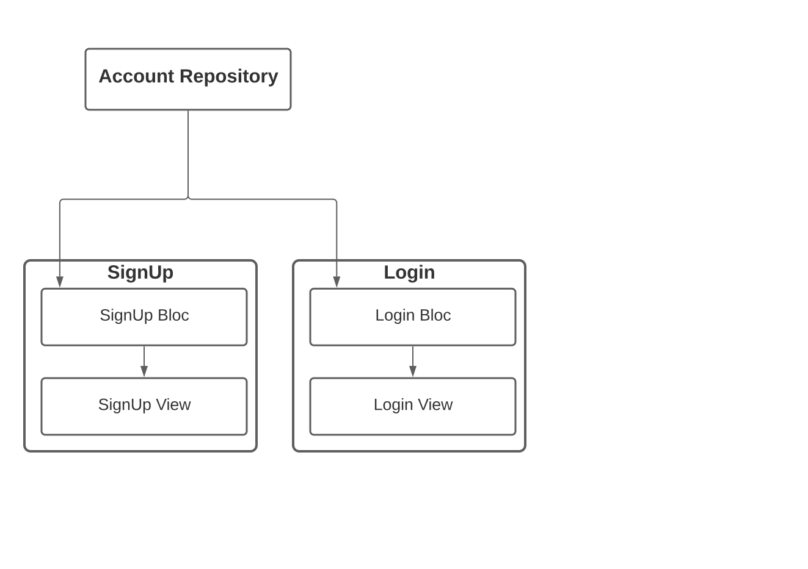

Of course, depending on our needs, we could create only one feature, authentication, with only one bloc and only one page. But separating them as much as possible is generally good practice, especially when considering UI and navigation.

**Consistency**: Try avoiding **Bloc-to-Bloc** communication as much as possible. Keeping a clean layered pattern is not only beneficial to our app's functioning and testing capabilities but also makes it easier to read and understand. Modules have a many-to-many relationship with features, and blocs should have no relationship between them at all.

[See directory structure for business logic.](#bloc_directory)

**Injection**: Blocs should respect the repository pattern and use data through dependency injection.

```dart
class AuthenticationBloc extends Bloc<AuthenticationEvent, AuthenticationState>{

  final AuthenticationRepository authenticationRepository;

  const AuthenticationBloc({
    required this.authenticationRepository
  });
}
```

### Presentation Layer

The presentation layer is strictly UI-building reactive to the bloc's state. It would be best to separate all the presentation-building in a file *example_view.dart* away from the bloc provider declaration in *example_page.dart*.

**Example (_view.dart)**

```dart
import 'package:flutter/material.dart';

class AuthenticationView extends StatelessWidget {

  Widget build(BuildContext context) {
    return Scaffold(
      body: Center(
        child: Column(
          children: [
            Text('Authentication'),
            Text('View')
          ]
        )
      )
    );
  }
}
```

**Example (_page.dart)**

```dart
import 'package:flutter/material.dart';
import 'package:flutter_bloc/flutter_bloc.dart';

class AuthenticationPage extends StatelessWidget {

  static PageRoute get route => MaterialPageRoute(builder: (_) => AuthenticationPage());

  @override
  Widget build(BuildContext context) {
    return BlocProvider(
      create: (_) => AuthenticationBloc(),
      child: AuthenticationView()
    );
  }
}
```

UI components throughout the app can reference themselves. Only bloc-to-bloc is discouraged. For example, I can use a widget from my tasks feature on my account page or vice versa.

[See directory structure for presentation.](#view_directory)

### Full Example

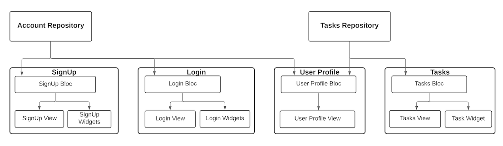

## Directory Structure

To make an idea of how a project using the BRUT architecture concept looks like in terms of folder hierarchy, see the following expanded tree:

```
.
└── my_flutter_app/
    ├── lib/
    │   ├── features/
    │   │   ├── app
    │   │   ├── auth/
    │   │   │   ├── cubit/
    │   │   │   │   ├── auth_cubit.dart
    │   │   │   │   └── auth_state.dart
    │   │   │   ├── input/
    │   │   │   │   ├── email_input.dart
    │   │   │   │   └── password_input.dart
    │   │   │   ├── view/
    │   │   │   │   ├── auth_page.dart
    │   │   │   │   └── auth_view.dart
    │   │   │   ├── widgets/
    │   │   │   │   └── auth_tab_widget.dart
    │   │   │   └── auth.dart
    │   │   └── profile_creation
    │   ├── l10n
    │   └── plugins
    ├── packages/
    │   ├── my_authentication/
    │   │   ├── lib/
    │   │   │   ├── src/
    │   │   │   │   ├── models/
    │   │   │   │   │   └── user_account.dart
    │   │   │   │   ├── exceptions/
    │   │   │   │   │   └── auth_exception.dart
    │   │   │   │   ├── apis/
    │   │   │   │   │   ├── auth_api.dart
    │   │   │   │   │   ├── firebase_auth_api.dart
    │   │   │   │   │   └── mocked_auth_api.dart
    │   │   │   │   └── auth_repository.dart
    │   │   │   └── my_authentication.dart
    │   │   └── pubspec.yaml
    │   └── my_theme
    └── pubspec.yaml
```

The `lib/features` folder must contain directories, each representing a piece of functionality or **feature**. 

The `lib/` directory must contain your app's entry points (e.g., `main_development.dart`), localisation files, and other plugins and extensions.

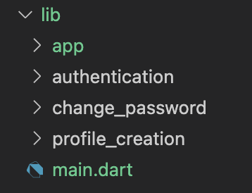

The `packages/` folder contains directories, each representing a module that exposes models, data repositories, or a theme library. Custom packages are generally made solely for the project.


Treating packages as microservices benefits the overall structure; therefore, it is also allowed to host them somewhere separate, for example, on multiple GitHub repositories. The `packages/` folder only contains local packages.

### Feature Directory

A feature directory contains everything regarding that specific functionality. This is where you find your **view** and **logic**, each in it&#39;s own folder:

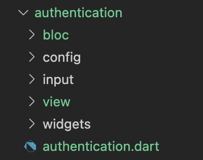

A barrel file (`auth.dart`) is also present, exporting all the files:

```dart
export 'view/auth_page.dart';
export 'view/auth_view.dart';

export 'bloc/auth_bloc.dart';

export 'input/email.dart';
export 'input/password.dart';
```

Each folder and file should follow the snake case convention (e.g. profile_creation, profile_creation_page.dart).

### View Directory

The view directory only has two files:

- View (`auth_view.dart`) - building UI and widgets
- Page (`auth_page.dart`) - exposing logic providers and routing

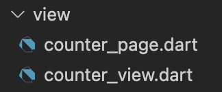

### BLoC Directory

You will write your feature-specific logic in a folder named &quot;cubit&quot; or &quot;bloc&quot;. Normally, a bloc contains three files: the BLoC, the state and the event. A cubit will only have the cubit and the state. Eg. _auth\_bloc.dart, auth\_state.dart, auth\_event.dart_.

BRUT standards always prefer using cubits, as logic should be simple enough. Again, this framework's philosophy is simplicity over everything. Logic pieces should be self-explanatory.

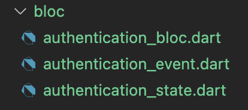

### Input Directory

If your feature contains text fields for user input, a directory `input/` will also be present. Every field type must have it&#39;s own [formz](https://pub.dev/packages/formz) file (e.g. email fields will use an `EmailInput` formz class).

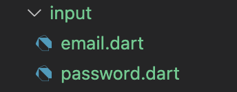

### Widgets Directory

Widgets used inside the view are located inside a `widgets` folder.

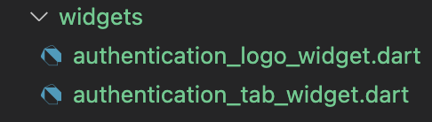

### Config Directory

A feature might need a configuration or static data. This should go into it&#39;s own `config` folder.

### Other Directories

These are the most common folders you will typically find inside a feature, covering most of your needs. If necessary, you can create additional folders. 

**Example (feature tree)**

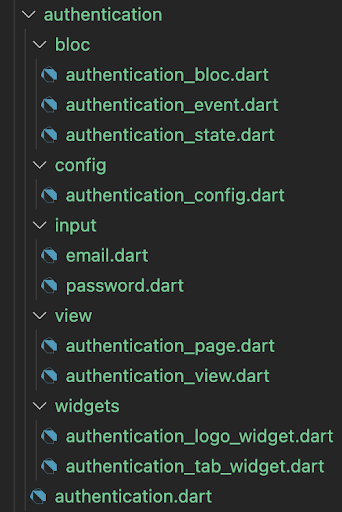

### Module Directory

As previously mentioned, we consider modules to be Flutter or Dart packages that we use in our app. To persist abstraction as much as possible, our data services, repositories, and models will be separated into these packages, as will our theme library.

These modules can be located inside the Flutter app directory or in a separate location in case you need to re-use them, for example, for an app's admin panel.

A packages directory situated inside your Flutter app should look similar to the example below:

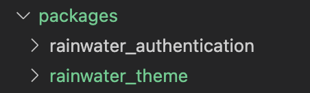

A theme package is a Flutter library that contains all the custom widgets and theme data used in your app.

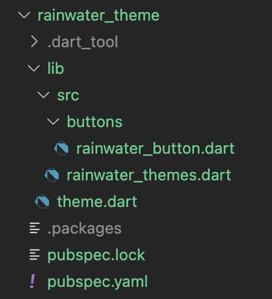

A data package is a standard data provider that exposes models and repositories for your use. A repository can access data on a local disk or the Internet.

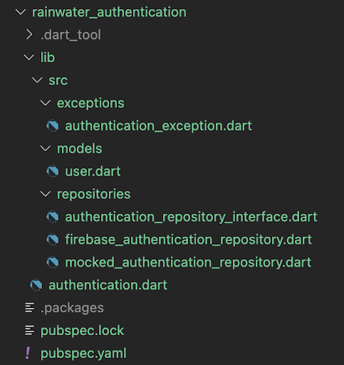

As observed, we have three main folders:

- models - models specific to our module
- repositories - data service for our module - abstracted into an interface and implementations
- exceptions - if you want to use custom exceptions (example)

## Examples

**Featured Apps:**
1. [Simple LAN Chat](https://github.com/nathanielxd/simple-lan-chat)
2. [Lethologica](https://github.com/nathanielxd/lethologica)

**Quick resources:**
1. Custom Exceptions
2. Bloc States

[WIP]

## CLI
WIP

## Why?

Bloc itself is an amazing concept, and I thank [Felix Angelov](https://github.com/felangel) and the Flutter community for making the excellent state-management library.

What I thought is that blocs and many other patterns lack a strict architectural pattern. There are many inconsistencies in examples and tutorials all over the internet, and many people find it hard to implement blocs their own way.

Initially, I just wanted to make an extension to help me with the boilerplate code and structuring, so I came up with a stricter way of managing and organising a flutter project using bloc, that also comes with a directory structure.

Main points I made while creating this were:
- Abstract everything as much as possible, allowing us a scalable, understandable and testable application
- A clearer and cleaner way of organising and scaling a project 
- Many developers working with a single concept in mind
- Reuse many components through out the apps

As it is now, it still is a **work in progress** and I urge everyone to ask questions, clarifications and make suggestions.

## Contribute

This project still requires attention and I'd love to get everyone's input, suggestions and feedback on it. Please do not hesitate to contribute or contact me regarding absolutely anything at [dragusinnathaniel@gmail.com](mailto:dragusinnathaniel@gmail.com).
