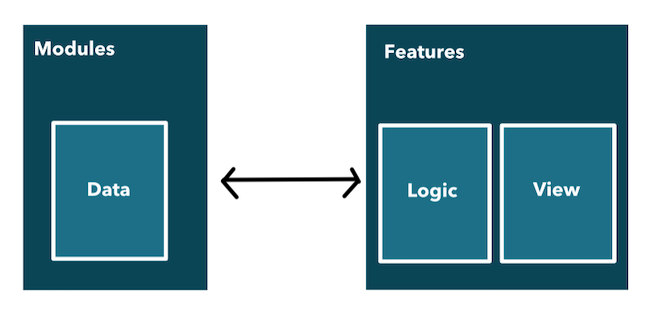
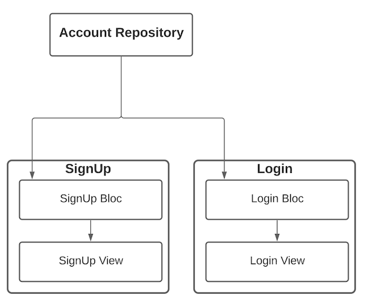
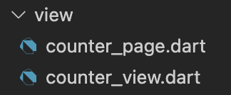

# Documentation

This document serves the purpose to analyze the **architecture**, **structure** and **implementation** of the architectural design pattern Flutterfall.

## Table of Contents

1. [Overview](#overview)
2. [Architecture](#architecture)
3. [Directory Structure](#directory_structure)
4. [Examples](#examples)
5. [Why?](#why?)
6. [Contribute](#contribute)

## Overview <a name = "overview"></a>

Flutterfall is an architectural design pattern uses bloc to create an architecture featuring:

- Separation of models, logic and view
- A firm and consistent directory structure easy to understand
- Treatment of models and data providers as microservices separate from the main application
- Abstraction of data repositories allowing modular backend implementation

## Architecture <a name = "architecture"></a>



By using the bloc pattern, we separate our application in 3 layers:
- Presentation View
- Business Logic
- Data
  - Models
  - Repositories

We treat and organise these layers as such:
- A **feature** is a congregation of *business logic* and *presentation*
- A **module** is a microservice package consisting of *models* and *data repositories* that feeds into multiple features

A general relation between data and features can be observed in the following diagram:


### Data Layer

The data layer is our module layer. A data module contains **models**, **data sources** and **data repositories** that provide either real or mocked data to our application.

**Reusable**: Treating data layers as microservices help us with reuseability through multiple projects and is generally a good rule for clean architecture. These services are basic Flutter or Dart **packages**, then referenced in our main app's pubspec.yaml.


These packages can be either stored in a directory - */packages* or */modules* in our main project folder and referenced locally OR somewhere else and hosted on a git source.

[See directory example for modules.](#module_directory)

**Scalable**: For each data source there MUST be an abstract repository **interface** that is implemented by one or more repositories. This allows us to implement multiple repositories (eg. Firebase, RESTful, Mocked, Local Storage) and switch them whenever we need to or migrate to another provider, ensuring scalabilty.

```dart
abstract class IAuthenticationRepository {
  /// Get stream of current user.
  Stream<User> get stream;
  /// Get current user.
  User get currentUser;
  /// Authenticate a new user and updates [stream].
  Future<void> login(String email, String password);
  /// Logs out the existing user and updates [stream] with an empty user.
  Future<void> logout();
}
```

### Business Logic Layer

The business logic layer is a bridge between the user interface - presentation and the data layer. Flutterfall architecture imposes certain rules that handle the organisation of the business logic.

**Abstraction**: Each feature - from a presentation point-of-view: a widget, page or multitude of pages has no more than **one** business logic component. This forces us to expand our app functionality in as many features as possible.

> **Example**
> We want to implement authentication therefore we make a sign up page and a log in page. We will create two **features** so there will be a logic component for each of them: 
- sign_up_bloc.dart - handles account creation, user input of 3 text fields (email, password, confirmation)
- login_bloc.dart - containing account authentication, user input 2 text fields (email, password)

All these BLoCs will use the same authentication_repository.dart.



Of course, depending on our needs, we could create only one feature *authentication* with only one bloc and only one page. But it's generally good practice to separate them as much as possible, especially taking into consideration UI and navigation.

**Consistency**: Try avoiding **Bloc-to-Bloc** communication as much as possible. Keeping a clean layered pattern is not only beneficial to the functioning and testing capabilities of our app, but also makes it easier to read and understand. **Modules** have a many-to-many relationship with features, and blocs should have no relationship in between them at all.

[See directory structure for business logic.](#bloc_directory)

**Injection**: Blocs should respect the repository pattern and use data through dependency-injection.

```dart
class AuthenticationBloc extends Bloc<AuthenticationEvent, AuthenticationState>{

  final IAuthenticationRepository authenticationRepository;

  const AuthenticationRepository({
    required this.authenticationRepository
  });
}
```

### Presentation Layer

The presentation layer is strictly UI building reactive to the bloc's state. You should separate all the presentation building in a file *example_view.dart* away from the bloc provider declaration from *example_page.dart*.

Example of a **view**:

```dart
import 'package:flutter/material.dart';

class AuthenticationView extends StatelessWidget {

  Widget build(BuildContext context) {
    return Scaffold(
      body: Center(
        child: Column(
          children: [
            Text('Authentication'),
            Text('View')
          ]
        )
      )
    );
  }
}
```

Example of a **page**:

```dart
import 'package:flutter/material.dart';
import 'package:flutter_bloc/flutter_bloc.dart';

class AuthenticationPage extends StatelessWidget {

  static PageRoute get route => MaterialPageRoute(builder: (_) => AuthenticationPage());

  @override
  Widget build(BuildContext context) {
    return BlocProvider(
      create: (_) => AuthenticationBloc(),
      child: AuthenticationView()
    );
  }
}
```

Tip: UI components throughout the app are can be referencing themselves. Only bloc-to-bloc is discouraged. For example, I can use a widget from my *tasks* feature in my *account* page, or vice-versa.

[See directory structure for presentation.](#view_directory)

### Full Example


## Directory Structure <a name = "directory_structure"></a>

To make an idea of how a project using the Flutterfall's architecture concept looks like in terms of folder hierarchy, see the following expanded tree:

```
my_flutter_app/
├─ lib/
│  ├─ app/
│  ├─ authentication/
│  │  ├─ bloc/
│  │  │  ├─ authentication_bloc.dart
│  │  │  ├─ authentication_state.dart
│  │  │  ├─ authentication_event.dart
│  │  ├─ input/
│  │  │  ├─ email.dart
│  │  │  ├─ password.dart
│  │  ├─ view/
│  │  │  ├─ authentication_page.dart
│  │  │  ├─ authentication_view.dart
│  │  ├─ widgets/
│  │  │  ├─ authentication_tab_widget.dart
│  │  ├─ authentication.dart
│  ├─ profile_creation/
│  ├─ main.dart
├─ packages/
│  ├─ my_authentication/
│  │  ├─ lib/
│  │  │  ├─ src/
│  │  │  │  ├─ models/
│  │  │  │  │  ├─ user_account.dart
│  │  │  │  ├─ exceptions/
│  │  │  │  │  ├─ authentication_exception.dart
│  │  │  │  ├─ repositories/
│  │  │  │  │  ├─ authentication_repository_interface.dart
│  │  │  │  │  ├─ mocked_authentication_repository.dart
│  │  │  │  │  ├─ firebase_authentication_repository.dart
│  │  │  ├─ authentication.dart
│  │  ├─ pubspec.yaml
│  ├─ my_theme/
├─ pubspec.yaml
```

The _lib/_ folder must contain directories each representing a **piece of functionality** or **feature** and finally the entry-point of your app, _main.dart_:


The _packages/_ folder contain directories each representing a **module** that exposes **models** and **data repositories** or a theme library. Generally, custom packages made solely for the project.


Treating packages as microservices is beneficial to the overall structure therefore it is also allowed to host them somewhere separate, for example on multiple github repositories. The _/packages_ folder only contains **local** packages.

### Feature Directory <a name = "feature_directory"></a>

A feature directory contains everything regarding that specific functionality. This is where you find your **view** and **logic**, each in it&#39;s own folder:


A barrel file (_authentication.dart)_ is also present, exporting all the files:

```dart
export 'view/authentication_page.dart';
export 'view/authentication_view.dart';

export 'bloc/authentication_bloc.dart';

export 'input/email.dart';
export 'input/password.dart';
```


> **Each folder and file should be respecting the snake case style** _(profile\_creation/, profile\_creation\_page.dart)._

### View Directory <a name = "view_directory"></a>

The view directory relates only to the specific functionality. It must have 2 files:

- View (_authentication\_view.dart_) - containing **UI & Widgets**
- Page (_authentication\_page.dart_) - exposing logic **providers** & routing to the view



### BLoC Directory <a name = "bloc_directory"></a>

You will write your feature-specific logic in a folder named &quot;cubit&quot; or &quot;bloc&quot;. Normally, a bloc contains 3 files: the bloc itself, the state and the event. A cubit will only have the cubit and the state. Eg. _authentication\_bloc.dart, authentication\_state.dart, authentication\_event.dart_.


### Input Directory

If your feature is going to contain text fields for user input, a directory named _input_ will also be present. Every field type must have it&#39;s own **formz** file. [You can read about formz here](https://pub.dev/packages/formz).


### Widgets Directory

Widgets that are being used inside the view are located inside a _widgets_ folder.


### Config Directory

A feature might need a configuration or static data. This should go into a it&#39;s own _config_ folder.

### Other Directories

These are the most common folders you&#39;ll have inside a feature that should cover most of your needs. If anything, you can create more.

Overall, a feature directory should look similar to this:


### Module Directory <a name="module_directory"></a>

As previously mentioned, we consider modules - Flutter or Dart packages that we use in our app. To persist abstraction as much as possible, our data services, repositories and models will be separated into these packages; same with our theme library.

These modules can be situated inside the Flutter app directory or in a separate place, in case you will need to re-use them, maybe for an admin panel for your app.

A packages directory situated inside your flutter app should look similar to the example below:


A **theme package** is a Flutter library that contains all your custom widgets and theme data used in your app.


A **data package** is a standard data provider that exposes models and repositories for your use. A repository can access data either on a local disk or the internet.


As observed, we have 3 main folders:

- models - models specific for our module
- repositories - data service for our module - abstracted into an interface and implementations
- _exceptions_ - if you want to use custom exceptions (example)

## Examples <a name = "examples"></a>

**App examples:**
1. [Counter](https://github.com/nathanielxd/flutterfall/tree/master/examples/counter_example)
2. [Authentication](https://github.com/nathanielxd/flutterfall/tree/master/examples/authentication_example)

**Quick resources:**
1. Custom Exceptions
2. Bloc States


## Why? <a name = "Why?"></a>

Bloc itself is an amazing concept and I thank [Felix Angelov](https://github.com/felangel) and the Flutter community for making the awesome state-management library.

What I thought is that bloc's and many other patterns lack a strict architectural pattern. There are many inconsistencies in examples and tutorials all over the internet and a lot of people find it hard to implement bloc their own way.

So I came up with a stricter way of managing and organising a flutter project using bloc, that also comes with a directory structure.

Main points I made while creating this were:
- Abstract everything as much as possible, allowing us a scalable, understandable and testable application
- A clearer and cleaner way of organising and scaling a project 
- Many developers working with a single concept in mind
- Reuse many components through out the apps

As it is now, it still is a **work in progress** and I urge everyone to ask questions, clarifications and make suggestions.

I aim to make this project a powerful design helping developers make complex applications by composing them of smaller components but also a simple enough so that much more people trying to get into Flutter can understand it.

## Contribute <a name = "Contribute"></a>

This project still requires attention and I'd love to get everyone's input, suggestions and feedback on it. Please do not hesitate to contribute or contact me regarding absolutely anything at [me@nathans.dev](mailto:me@nathans.dev).